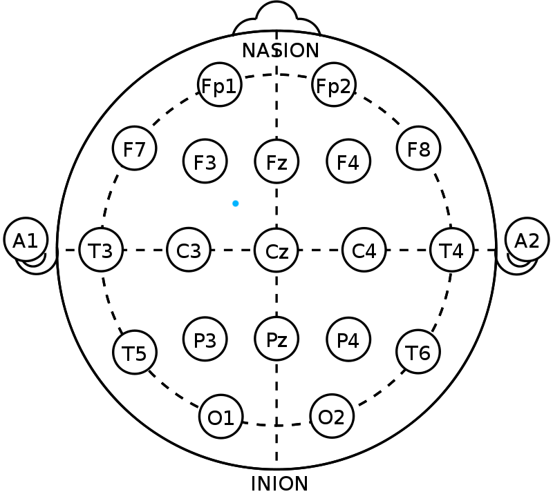
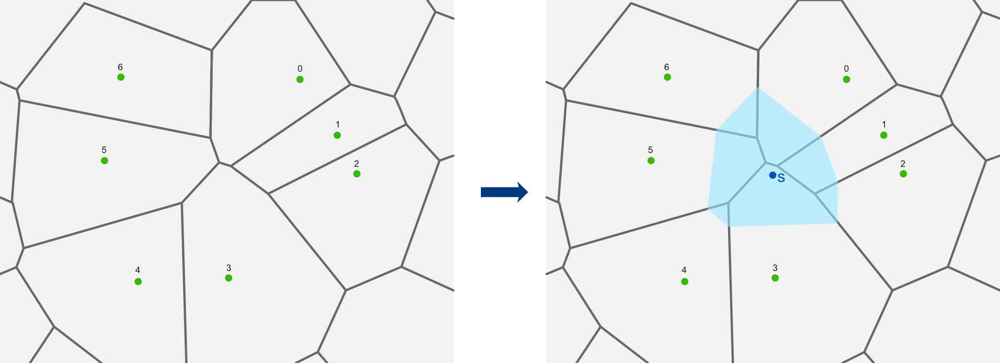
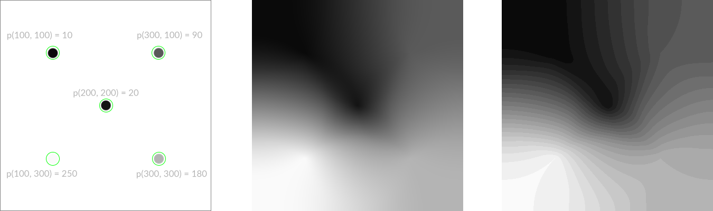
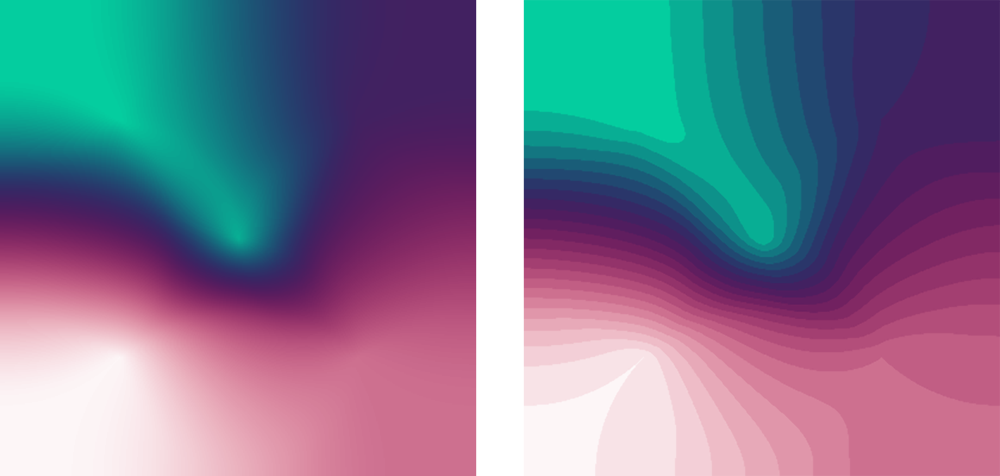

When dealing with scientific measurements, we usually have two kinds of datasets: a regular matrix of data with a regular sampling, or, a not so regular sampling, with sparse data points here and there. In both situations, a lot of different techniques exist to interpolate the original dataset and find values where there was no sampling. In this article, we will focus on the second situation.

Sparse data interpolation is a recurrent topic in geographic information system (GIS) due to the challenge of sampling terrains using a regular grid but at the lab, we intend to use this method for electroencephalogram (EEG).
The context of EEG is comparable to GIS in the sense that the scalp [montage 10/20](https://en.wikipedia.org/wiki/10–20_system_(EEG)) becomes irregular when projected on a 2D disc:



Say we have all the position of the sensors and the values they have recorded, what if we want to know the value at the blue point? Several methods are available:
- **Nearest Neighbor**: just take the closest sensor's values. Does not create any gradient, a bit too brutal for our use.
- **Inverse Distance Weighted**: the further the sensor, the lower its influence. Less and less used in the field because it creates inaccurate local minimas.
- **Barycentric**: linear interpolation within triangles, usually using Delaunay triangulation. The linearity is not always welcome in EEG and this method tends to create local artifact due to the triangulation.
- **Natural Neighbor**: we build a Voronoi diagram using the sensor, adding a new point means adding a new cell that "steals area" to others. Said to be close to the real function but is very computational.
- **Kriging**: statistical approach based on the continuity of the original measures. Usually gives very good results but quite complex to implement. we'll keep this one for another time!

Since Google came with its very fast Javascript engine ([V8](https://en.wikipedia.org/wiki/Chrome_V8)) we can afford to implement greedy algorithms in Javascript, this is why I decided to give a try to the Natural Neighbor Interpolation (nni).

## Quick Algorithmic Part

The original concept is really quite simple, as long as we pass on how to build a Voronoi diagram (VD), part that will no be covered here.

Sensors have recorded values (green dots), Voronoi cells are created from these seeds (grey lines). Now we want to know the value at the blue point in the right image, we rebuild the VD with all the seed + the sample point. The newly created cell (blue) stole some area to some of the cells of the first set.



To know the influence of each sensor on the sample S, we have to compute the area that the blue polygon stole to each of the preexisting cells. On this example, we can estimate that the cell 0, 3 and 5 contributed the most while the cell 1, 2, 4 and 6 only bring minor contributions.

With a more programmatic approach, here is what happened:

```
Find all the cells from the first set that have seen their boundaries changed by the introduction of the blue cell. There are N cells like that.

Compute the area of the blue cell --> _bca
Create an empty array of weight _w of size N

For each cell _cn that was modified from the original set:
    - create an intersection polygon between _cn (on its original shape) and the blue cell
    - compute the area of this intersection polygon --> _cna
    - compute the ratio ( _cna / _bca ) --> _w[n]
end for.
```

We now have an array of all the weights (aka. stolen ratio) involved in finding the values of the point **S**. If we repeat that for each pixel of the output image, we end up with a large array of array of weights, we call that the *sampling map*.
At this stage, we still don't know what is the value at the point **S**, so we have to multiply all the weights by the sensors' value to get it!

> **Note** that the values of the sensor don't matter in the construction of the *sampling map*, only their positions. This is actually very important because even though this map takes a lot of resources to generate, we can reuse it to create another output image when the values of the sensors change.

## How do we use it?
I called this package `natninter`, which is really a bad name. Anyway, you can find the [GitHub repo here](https://github.com/jonathanlurie/natninter) with all the instructions to make it run. For the moment, it seems to be the first and only JS implementation available (yeah!)

To make it short, you need a list of seeds with their positions and values, an output size and an instance of the `Interpolator`:

``` javascript
// a list of seeds
let seeds = [
  {x: 100, y: 100,  value: 10 },
  {x: 300, y: 100,  value: 90  },
  {x: 300, y: 300, value: 180 },
  {x: 100, y: 300, value: 250  },
  {x: 200 , y: 200 , value: 20 }
];

// creating the nni interpolator instance
let nnInter = new natninter.Interpolator();

// setting the output size
nnInter.setOutputSize(256, 256);

// add a list of seeds
nnInter.addSeeds( seeds );

// Create the interpolation map
// (this may take some seconds, start with a small image to benchmark it)
nnInter.generateMap();

// generate the output image witha  nice interpolation
let output = nnInter.generateImage();
```

On the following image, you can see the seeds (left), the output image (center) and another version of the interpolation (right) using simple threshold clusters as it is usually the case in GIS or medical imaging



With a proper library, we can even imagine applying a colormap on the result for a better readability:



Next step will probably be about the integration of natural neighbors and sampling map management in [Pixpipe](https://github.com/Pixpipe/pixpipejs) to use it in a real EEG case.  
Cheers.
